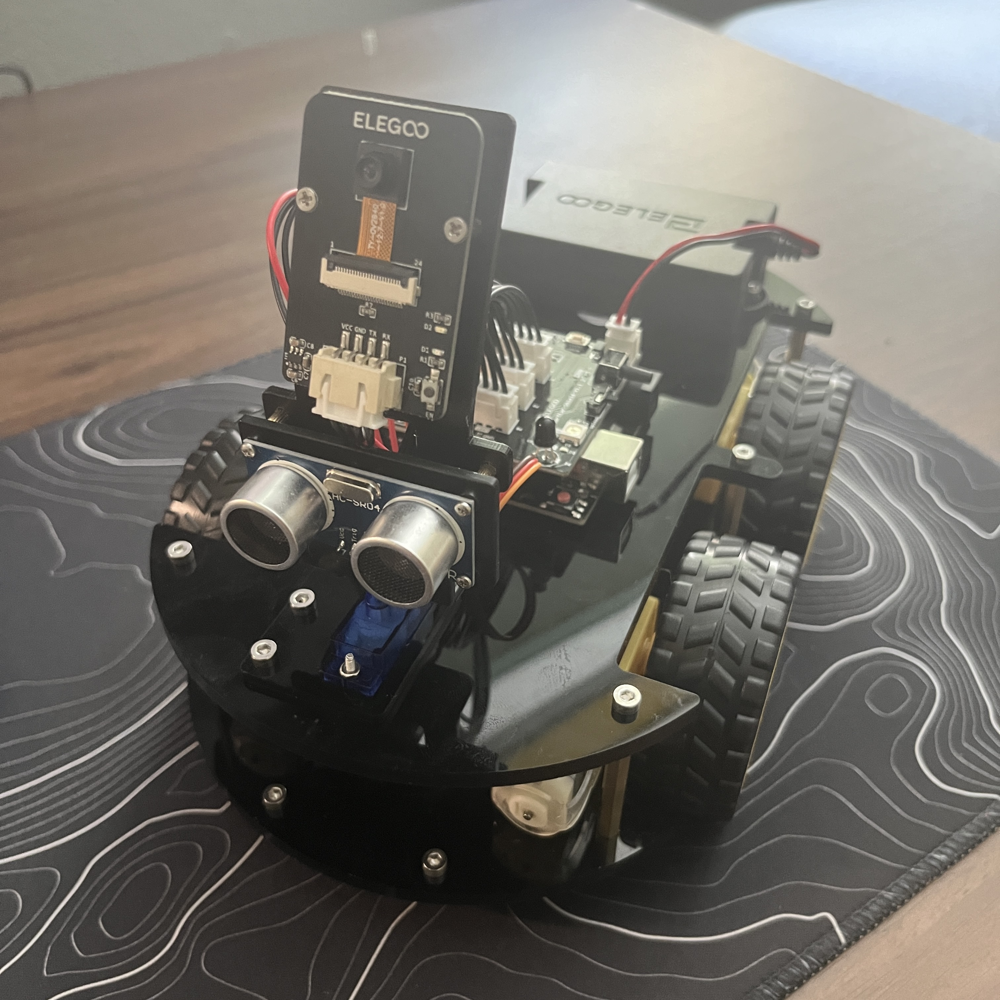

# BlueStamp RC Car
Replace this text with a brief description (2-3 sentences) of your project. This description should draw the reader in and make them interested in what you've built. You can include what the biggest challenges, takeaways, and triumphs from completing the project were. As you complete your portfolio, remember your audience is less familiar than you are with all that your project entails!

You should comment out all portions of your portfolio that you have not completed yet, as well as any instructions:
```HTML 
<!--- This is an HTML comment in Markdown -->
<!--- Anything between these symbols will not render on the published site -->
```

| Medhansh G | BASE  | Areospace Engineering | Incoming Freshman



```  
# Final Milestone

**Don't forget to replace the text below with the embedding for your milestone video. Go to Youtube, click Share -> Embed, and copy and paste the code to replace what's below.**

<iframe width="560" height="315" src="https://www.youtube.com/embed/F7M7imOVGug" title="YouTube video player" frameborder="0" allow="accelerometer; autoplay; clipboard-write; encrypted-media; gyroscope; picture-in-picture; web-share" allowfullscreen></iframe>

For your final milestone, explain the outcome of your project. Key details to include are:
- What you've accomplished since your previous milestone
- What your biggest challenges and triumphs were at BSE
- A summary of key topics you learned about
- What you hope to learn in the future after everything you've learned at BSE
```


# Second Milestone


<iframe width="560" height="315" src="https://www.youtube.com/embed/SKRgafY-li4" title="YouTube video player" frameborder="0" allow="accelerometer; autoplay; clipboard-write; encrypted-media; gyroscope; picture-in-picture; web-share" allowfullscreen></iframe>

- To adjust the turning speed of the RC Car, we first needed to locate where the turning speed was defined, understand how it works, and learn how to adjust it. So, we began by examining a simpler demo
  code which controlled all the movements of the RC Car (forward, backward, left, right, etc.). We identified the section of the code responsible for controlling the motors during left and right turns,
  and then we conducted experiments. Initially, we attempted to reduce the speed of both sets of motors by half, and this adjustment proved successful. Next, we located the part of the main code that
  defines the turning speed and decreased it by half. This alteration allows the RC Car to execute slower turns when the left or right button on the IR remote is pressed, resulting in turns ranging
  between 30 to 90 degrees instead of a full 180° rotation. We also discovered that the extent to which the RC Car turns can be influenced by the surface it is driven on. For instance, it will make
  small turns on carpet compared to larger turns on a harder surface like wood or marble. Presently, we can further refine the turning speed, but for now, this progress marks a solid starting point for   more modifications.

  

# First Milestone

<iframe width="560" height="315" src="https://www.youtube.com/embed/XBWzefHsQAk" title="YouTube video player" frameborder="0" allow="accelerometer; autoplay; clipboard-write; encrypted-media; gyroscope; picture-in-picture; web-share" allowfullscreen></iframe>

- This RC car has 2 chassis. The lower chassis holds the 4 motors, 4 wheels, and the line tracking module. Each motor controls one wheel. The line tracking module lets the RC car follow a line made out
  of tape on the ground. The upper chassis contains an ultrasonic sensor with the SG90 motor. It also contains the camera module, Arduino UNO, IO expansion board, and the cell box. The SG90 motor is
  attached to the ultrasonic sensor, and the camera module is attached to the ultrasonic sensor. This means that both the ultrasonic sensor and the camera module can turn 180°. The ultrasonic sensor can
  be used in obstacle avoidance mode, where it checks if there is an obstacle in front of it and decided if it should move in that direction or not. You can use the ultrasonic sensor for auto-follow
  mode which lets it follow anything within 20 cm.  The camera module lets you use it through the app and control the RC car. The Arduino UNO is what controls all the components. The IO extension board
  helps wire all of the components into the Arduino UNO. And the cell box powers all the components.
  
- I have finished building the RC car and wiring all the components. And then completed uploading the main code to the car.
  
- I faced the challenge of uploading the code to the arduino UNO. I fixed it by taking off the hat on the arduino and then upload it using a usb C to A adapter. Then after the upload put the extention
  hat back on.
  
- From here I am think of making modifications, but I am still not sure what modifications to make.

# Schematics 
Here's where you'll put images of your schematics. [Tinkercad](https://www.tinkercad.com/blog/official-guide-to-tinkercad-circuits) and [Fritzing](https://fritzing.org/learning/) are both great resoruces to create professional schematic diagrams, though BSE recommends Tinkercad becuase it can be done easily and for free in the browser. 

# Code
Here's where you'll put your code. The syntax below places it into a block of code. Follow the guide [here]([url](https://www.markdownguide.org/extended-syntax/)) to learn how to customize it to your project needs. 

```c++
void setup() {
  // put your setup code here, to run once:
  Serial.begin(9600);
  Serial.println("Hello World!");
}

void loop() {
  // put your main code here, to run repeatedly:

}
```

# Bill of Materials
Here's where you'll list the parts in your project. To add more rows, just copy and paste the example rows below.
Don't forget to place the link of where to buy each component inside the quotation marks in the corresponding row after href =. Follow the guide [here]([url](https://www.markdownguide.org/extended-syntax/)) to learn how to customize this to your project needs. 

| **Part** | **Note** | **Price** | **Link** |
|:--:|:--:|:--:|:--:|
| Item Name | What the item is used for | $Price | <a href="https://www.amazon.com/Arduino-A000066-ARDUINO-UNO-R3/dp/B008GRTSV6/"> Link </a> |
| Item Name | What the item is used for | $Price | <a href="https://www.amazon.com/Arduino-A000066-ARDUINO-UNO-R3/dp/B008GRTSV6/"> Link </a> |
| Item Name | What the item is used for | $Price | <a href="https://www.amazon.com/Arduino-A000066-ARDUINO-UNO-R3/dp/B008GRTSV6/"> Link </a> |

# Other Resources/Examples
One of the best parts about Github is that you can view how other people set up their own work. Here are some past BSE portfolios that are awesome examples. You can view how they set up their portfolio, and you can view their index.md files to understand how they implemented different portfolio components.
- [Example 1](https://trashytuber.github.io/YimingJiaBlueStamp/)
- [Example 2](https://sviatil0.github.io/Sviatoslav_BSE/)
- [Example 3](https://arneshkumar.github.io/arneshbluestamp/)

To watch the BSE tutorial on how to create a portfolio, click here.
